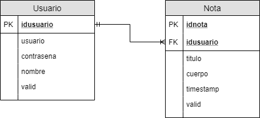

# JavAPI

Ejemplo de estructura para una API Rest con Java y SpringBoot

## Antes de probar
- Instalar la base de datos usando el script de creación de **MySQLWorkbench**
- Revisar el puerto en el **application.properties**

### Rutas
#### GET /
Muestra un saludo de bienvenida para la API

### Usuarios
#### GET /usuario
Obtiene todas los usuarios y sus notas en la db

#### GET /usuario/{idUsuario}
Obtiene una nota específica según el id pasado por la url

#### POST /usuario/ (Pendiente)
Guarda un usuario. 
Necesita los parámetros en **formdata**

- nombre

#### PUT /usuario/{idUsuario} (Pendiente)
Edita un usuario específica según el id pasado por la url
Necesita los parámetros en **formdata**

- nombre
- valid

#### DELETE /usuario/{idUsuario} (Pendiente)
- Elimina un usuario específica y todas sus notas según el id pasado por la url
- CascadeType.REMOVE

### Notas
#### GET /nota
Obtiene todas las notas guardads en la db

#### GET /nota/obtener/{idNota}
Obtiene una nota específica según el id pasado por la url

#### POST /nota/ (Pendiente)
Guarda una nota. 
Necesita los parámetros en **formdata**

- idUsuario
- titulo
- cuerpo

#### PUT /nota/{idNota} (Pendiente)
Edita una nota específica según el id pasado por la url
Necesita los parámetros en **formdata**

- idUsuario
- titulo
- cuerpo
- valid

#### DELETE /nota/{idNota} (Pendiente)
Elimina una nota específica según el id pasado por la url

## Patrón de Diseño
El patrón de diseño usado en este desarrollo es MVC. Sin embargo, presenta una variable en dónde se integran nuevos componentes en las capas. Un diagrama a continuación:

### Models

#### DTOS

- Estas clases son finalmente objetos de transporte de datos
- Su objetivo es compartir datos en la aplicación, transportar, compartir entre las distintas capas

#### Entities

- Estas clases están direcamente relacionadas con las entidades de la base de datos
- Son una repressentación de la base de datos fidedignamente
- Además se agregan las relaciones como una propiedad en la clase (revisar)

### Persistence

#### DAOS

El objetivo de esta capa es:

- Obtiene los datos usando el JPA

### Services

El objetivo de esta capa es:

- Obtiene los datos consultando a los DAOS

## Arquitectura

### Diagrama de clases (próximamente) 

- Pronto

### Modelo de datos

- Al tratarse de un ejemplo, es muy simple

## Futuro

- Escribir la documentación de la arquitectura incluyendo un diagrama de clases

## Dependencias Usadas
### log4j2
Usada para loggear o escribir mensajes de salida en un archivo de texto. Además permite colorear las salidas de los mensajes para fácil reconocimiento de la gravedad de los mensajes

## Documentación

- https://stackoverflow.com/questions/35197947/jpa-persist-parent-and-child-with-one-to-many-relationship